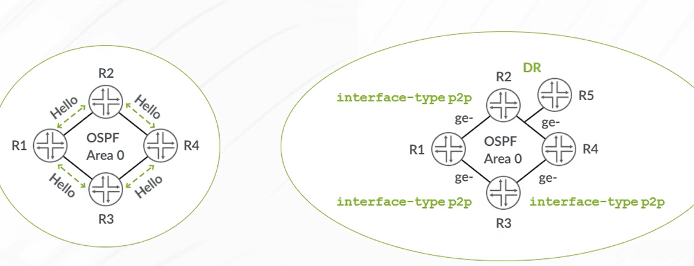

# the example 2


Some **text**!

- [ ] An item that needs doing
- [x] An item that is complete

```{admonition} This is my admonition
This is my note
```

```{admonition} My markdown link
Here is [markdown link syntax](https://jupyter.org)
```

:::{note}
This text is **standard** _Markdown_
:::

:::{table} This is a **standard** _Markdown_ title
:align: center
:widths: grid

abc | mnp | xyz
--- | --- | ---
123 | 456 | 789
:::


:::{figure-md}
{.bg-primary .mb-1 width=200px}

This is a caption in **Markdown**
:::

:::{figure-md} fig-target
:class: myclass


This is a caption in **Markdown**
:::
